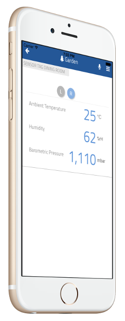

# thing-it-device-ti-sensortag

[](https://nodei.co/npm/thing-it-device-ti-sensortag/)
[](https://nodei.co/npm/thing-it-device-ti-sensortage/)

[thing-it-node] Device Plugin for [TI SensorTag CC2541](http://www.ti.com/tool/cc2541dk-sensor) and [TI CC2650 SensorTag](http://www.ti.com/tool/cc2650stk)


This allows you to 

* obtain sensor values and events for all SensorTag sensors,
* define complex services, event processing, storyboards and Jobs combining the SensorTag with other Devices, Sensors and Actors,
* remote access to your SensorTag devices from everywhere over the Internet.

by means of [thing-it-node](https://github.com/marcgille/thing-it-node) and [thing-it.com](http://www.thing-it.com).

## Installation

### Installation of NodeJS and [thing-it-node]

First, install [nodejs](https://nodejs.org/en/download/) on your computer (e.g. your PC or your Raspberry Pi).

Then install **[thing-it-node]** via

```
npm install -g thing-it-node
```
 
### Initialization and Start of [thing-it-node] 

The **[thing-it-device-ti-sensortag]** Plugin is installed with **[thing-it-node]**, hence there is no need to install it separately.

The Plugin supports Autodiscovery, hence you only have to create a directory in which you intend to run the configuration, e.g.
 
```
mkdir ~/hue-test
cd ~/hue-test
```
and invoke

```
tin init
```

and then start **[thing-it-node]** via

```
tin run
```

Install the **thing-it Mobile App** from the Apple Appstore or Google Play and set it up to connect to **[thing-it-node]** 
locally as described [here](https://thing-it.com/thing-it/#/documentationPanel/mobileClient/connectionModes) or just connect your browser under 
[http://localhost:3001](http://localhost:3001).
 
### SensorTag Setup

Push the Advertisement Button on the SensorTag.

On the **[thing-it] Mobile App** or in the browser, confirm the registration of the SensorTag.

You will be able monitor the SensorTag from the **[thing-it] Mobile App** immediately.

## User Interface

The UI depends on the settings of sensor quantities to be observed, e.g.



## Where to go from here ...

After completing the above, you may be interested in

* Configuring additional [Devices](https://www.thing-it.com/thing-it/#/documentationPanel/mobileClient/deviceConfiguration), 
[Groups](https://www.thing-it.com/thing-it/#/documentationPanel/mobileClient/groupConfiguration), 
[Services](https://www.thing-it.com/thing-it/#/documentationPanel/mobileClient/serviceConfiguration), 
[Event Processing](https://www.thing-it.com/thing-it/#/documentationPanel/mobileClient/eventConfiguration), 
[Storyboards](https://www.thing-it.com/thing-it/#/documentationPanel/mobileClient/storyboardConfiguration) and 
[Jobs](https://www.thing-it.com/thing-it/#/documentationPanel/mobileClient/jobConfiguration) via your **[thing-it] Mobile App**.
* Use [thing-it.com](https://www.thing-it.com) to safely connect your Node Box from everywhere, manage complex configurations, store and analyze historical data 
and offer your configurations to others on the **[thing-it] Mesh Market**.
* Explore other Device Plugins like [Philips Hue](https://www.npmjs.com/package/thing-it-device-philips-hue), [Plugwise Smart Switches](https://www.npmjs.com/package/thing-it-device-plugwise) and many more. For a full set of 
Device Plugins search for **thing-it-device** on [npm](https://www.npmjs.com/). Or [write your own Plugins](https://github.com/marcgille/thing-it-node/wiki/Plugin-Development-Concepts).