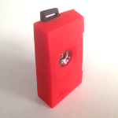
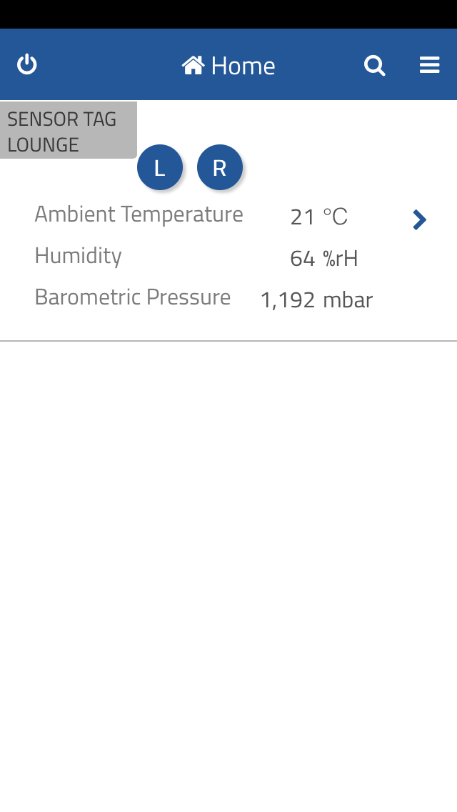

# thing-it-device-ti-sensortag

[thing-it-node] Device Plugin for [TI SensorTag CC2541](http://www.ti.com/tool/cc2541dk-sensor) and [TI CC2650 SensorTag](http://www.ti.com/tool/cc2650stk)

This allows you to 

* obtain sensor values and events for all SensorTag sensors,
* define complex services, event processing, storyboards and Jobs combining the SensorTag with other Devices, Sensors and Actors,
* remote access to your SensorTag devices from everywhere over the Internet.

by means of [thing-it-node](https://github.com/marcgille/thing-it-node) and [thing-it.com](http://www.thing-it.com).

## Installation

After you have 

* [set up](http://www.thing-it.com/thing-it/index.html?document=gettingStarted#/documentationPanel) your [thing-it] Node Box and 
* configured or copied a [thing-it] Mesh with a TI SensorTag, 

no further configuration is required.

## User Interface

The UI depends on the settings of sensor quantities to be observed, e.g.

